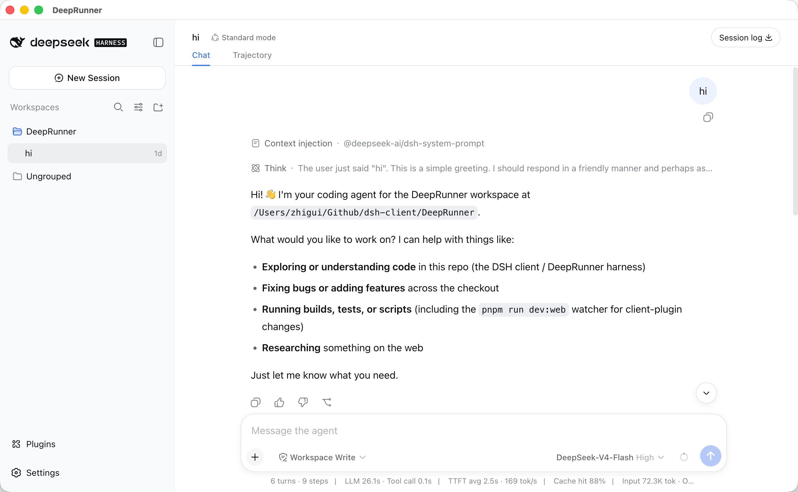

# DeepRunner

English | [中文](README.zh.md)

DeepRunner is a desktop client built on [DeepSeek Harness](https://github.com/deepseek-ai/deepseek-harness). It preserves the official DSH agents, sessions, tools, models, and Web UI while adding desktop capabilities such as profile recovery, a plugin market, system-terminal integration, a tray, and application updates.



## Implemented Features

- **DSH desktop runtime**: Starts the official DSH Web application in a single-instance Electron window. The host listens only on a random `127.0.0.1` port.
- **Profile recovery**: Discovers compatible local profiles and falls back to the last-known-good profile after a startup failure, or enters a dedicated recovery window and one-time safe mode. Normal application menus do not expose profile implementation details.
- **Plugin market**: Browses a pinned, controlled catalog; displays trust, provenance, and compatibility status; and installs, updates, disables, enables, or removes plugins for the current profile.
- **Manual source installation**: Accepts NPM package names, NPM package pages, and public GitHub repository root URLs. GitHub URLs are used only to discover and verify packages already published to NPM. Manual installations are always marked `Sideloaded · Unverified`.
- **DeepRunner Terminal**: Opens `dsh` and `pnpm` in the system terminal with the current profile environment. This is not currently an embedded PTY.
- **Desktop integration**: Provides application menus, a system tray, window hide and restore behavior, system/light/dark appearance modes, and `deeprunner://` plugin-market deep links.
- **Application updates and releases**: Packaged builds use `electron-updater` to check for and download updates from a pinned GitHub Releases source. The release pipeline requires macOS signing, supports optional Windows signing, validates metadata and checksums, and publishes only an allowlisted minimal asset set.

DSH model configuration, workspaces, sessions, agent workflows, and tool capabilities come from the pinned official runtime and are not reimplemented by DeepRunner.

## Current Limitations

- Manual installation does not support local `file:` or `link:` sources, private repositories, arbitrary registries, or direct installation of GitHub artifacts.
- The main window uses the system title bar on macOS, a title-bar overlay with Mica on Windows, and window-manager decorations on Linux. DeepRunner does not currently replace the official root layout or provide a custom renderer toolbar.
- Automatic updates are enabled only in packaged applications. Development runs do not check for updates.
- The macOS arm64 directory artifact and real-renderer smoke test have been validated. Windows, Linux, and macOS x64 installers and UI still require release-environment and physical-device validation.
- Desktop notifications and an embedded terminal have not been implemented and should not be considered delivered features.

## Local Development

Requirements:

- Node.js `22.19+` (also supports `24+`)
- Corepack
- Yarn `4.18.0` (pinned by the `packageManager` field)

Install dependencies and start the application:

```bash
corepack enable
corepack yarn install --immutable
corepack yarn build
corepack yarn start
```

On macOS, you can also use the development script. It rebuilds the application, stops the previous instance started by the script, and uses an isolated in-repository Electron user-data directory (including its private DSH home):

```bash
corepack yarn dev
```

Common commands:

```bash
corepack yarn check       # Docs/layout checks, upstream updater tests, build, typecheck, and tests
corepack yarn build       # Build every workspace
corepack yarn typecheck   # Run TypeScript type checking
corepack yarn test        # Run workspace tests
corepack yarn package:dir # Produce an unsigned directory artifact for the current platform
```

Normal builds use pinned, published `@deepseek-ai/*` packages. `upstream.json` records the corresponding upstream version and source commit. The repository does not commit a complete upstream checkout.

## Repository Structure

```text
apps/desktop/            Electron startup, windows, profiles, recovery, terminal, and updates
packages/contracts/      DeepRunner public types and boundaries
packages/desktop-plugin/ Desktop Host and Client plugins
packages/plugin-market/  Catalog, compatibility audit, operation services, and market UI
scripts/                 Upstream updates, layout, docs, packaging, and release validation
docs/                    Product, architecture, security, testing, and release documentation
upstream/                Pinned DSH upstream source reference
```

## Documentation

Start with the [development documentation index](docs/README.md). For a quick overview of the implementation boundaries, see:

- [Product scope](docs/product-scope.md)
- [Architecture](docs/architecture.md)
- [Profiles and plugins](docs/profiles-and-plugins.md)
- [Plugin market](docs/plugin-market.md)
- [Native UI](docs/native-ui.md)
- [Updates and releases](docs/updates-and-release.md)
- [Testing and quality](docs/testing-and-quality.md)
- [Roadmap](docs/roadmap.md)

## Design Principles

- Do not fork or modify the DSH agent loop, sessions, tools, models, or product UI.
- Keep the renderer configured with `sandbox: true`, `contextIsolation: true`, and `nodeIntegration: false`; do not expose a general-purpose preload or IPC bridge.
- Apply plugin and profile changes through controlled domain operations; do not expose an arbitrary shell to web content.
- Treat a full generation restart as the boundary for profile, theme, or plugin-composition changes.

## License

DeepRunner is licensed under the GNU Affero General Public License v3.0 or later.

You may use, study, modify, and redistribute the project. If you distribute the application or a modified version, you must notably:

- make the corresponding source code available;
- preserve copyright and license notices;
- distribute derivative works under the GNU AGPL v3.0 or later;
- make the corresponding source available when a modified version is offered to users over a network, including as a hosted service;
- document significant changes made to the project.

DeepRunner is an independently developed, unofficial client for DeepSeek Harness. It is not affiliated with, sponsored by, or endorsed by DeepSeek. DeepSeek Harness and other third-party components remain subject to their respective licenses; see [Third-Party Notices](THIRD_PARTY_NOTICES.md). This license does not grant trademark rights to use the DeepRunner name or marks in a way that suggests official affiliation, sponsorship, or endorsement.

See the [LICENSE](LICENSE) file for the complete and legally authoritative terms.
