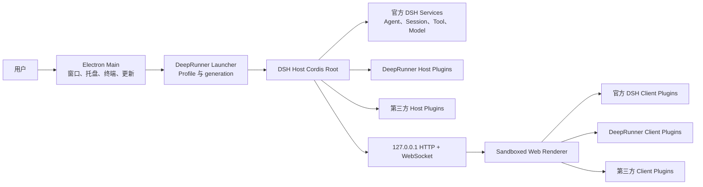

# 总体架构

状态：已规划

## 架构原则

DeepRunner 采用 Cordis 原生桌面宿主，不把 Harness 当作不可见的 CLI 子进程。Electron main 进程负责启动 Host Cordis root，并在 Loader entry 挂载前提供当前 generation 所需的桌面能力。

Web Renderer 仍通过上游 loopback HTTP/WebSocket carrier 工作。DeepRunner 不增加 preload，不向页面暴露 Electron IPC，也不复制官方 Web 应用。

## 逻辑架构

## 运行时层次

### Electron Native 层

只负责操作系统能力：

- 单实例、窗口、托盘和系统主题。
- 打开外部链接、目录或安装器。
- 原生终端启动和应用更新。
- Electron 应用退出、重启和签名信息。

该层通过内部 `deepRunnerRuntime` adapter 提供给 DeepRunner 自有 Host 插件。它不是第三方公共 API。

### Launcher 层

负责启动前不可从普通插件推断的事实：

- DSH Home。
- 当前 Profile 名称和绝对目录。
- Profile selection state。
- 打包的 DSH、pnpm、Node helper 路径。
- Electron ABI 和平台信息。
- 当前 presentation mode。

Launcher 在 Loader entry 启动前提供 bootstrap facts，然后调用上游 app-boot 建立 Cordis root。

### Host Cordis 层

包含：

- 上游官方 Host services。
- DeepRunner 自有 Host plugins。
- 用户 Profile 安装的第三方 Host plugins。

首批公共 DeepRunner services：

| Service | 作用 | 可见性 |
| --- | --- | --- |
| `deepRunnerProfiles` | 当前 Profile、只读发现、重启式切换 | 第三方可用 |
| `deepRunnerPackages` | 受控 pnpm 和 `dsh plugin` 操作 | 第三方可用 |
| `deepRunnerRuntime` | 窗口、托盘、终端、更新 adapter | 仅内部 |

公共 service 必须作用于单个 Cordis generation。插件不得跨重启缓存 service reference。

### Web Carrier

继续使用上游 Web Server 和 Client loader：

- Host 强制绑定 `127.0.0.1` 和随机端口。
- BrowserWindow 只允许同源主框架导航。
- HTTP、HTTPS 和 mailto 外部链接交给系统处理。
- Renderer 到 Host 的功能通信使用上游 route、RPC、metadata、service 和 slot 机制。
- DeepRunner 自有 route 仅承载 Client Loader 健康、主题同步和市场领域操作；Session 内容继续走上游流。

### Renderer 层

Renderer 由三类 Client plugin 组成：

- 官方 DSH UI。
- DeepRunner UI，包括市场入口；恢复界面由独立的本地 BrowserWindow 承载。
- 用户 Profile 的第三方 UI 插件。

Renderer 始终：

- `contextIsolation: true`
- `nodeIntegration: false`
- `sandbox: true`
- `webSecurity: true`
- 无通用 preload bridge

## 数据边界

| 数据 | 建议位置 | 所有者 |
| --- | --- | --- |
| DSH settings、sessions、profiles | DSH Home | 上游 DSH |
| Profile manifest 与 lockfile | Profile 目录 | 上游 CLI/Profile |
| 当前、pending、last-known-good | Electron `userData/profile-selection` | Launcher |
| 更新状态与下载 | 平台 updater 的应用私有缓存 | Update service |
| 生成的命令 shim | Electron `userData/runtime` | Launcher |
| 市场缓存 | 当前 Profile 的 `.deeprunner/market/catalog-v1.json` | Market Host plugin |
| UI 临时状态 | Renderer memory 或上游 settings | 对应 Client plugin |

DeepRunner 不把 DSH 核心数据复制到 Electron 私有数据库。

## 窗口模式

`compatibility` 与 `advanced` 仍是 generation contract 中的平台策略标记，但当前都使用上游完整 Web layout，不 patch 官方 root provider，也不创建 Renderer 自定义工具栏。

- macOS 使用系统 frame 和默认 title bar。
- Windows 的 advanced 策略使用系统 title-bar overlay、caption controls 与 Mica。
- Linux 固定使用 compatibility 策略并保留窗口管理器装饰。
- DeepRunner Client 只增加市场入口、主题同步和健康报告。

模式如需改变仍以 generation 重启为边界。当前决策见 [ADR-0007](adr/0007-system-owned-main-window-chrome.md)。

## 失败隔离

Host 与 Electron main 位于同一进程，换取直接的 Cordis/native adapter 组合能力。为控制风险：

- 未捕获错误进入 fail-loud 退出路径。
- Cordis dispose 有固定超时。
- 第二次退出请求立即升级为强制退出。
- Profile 和 Renderer 健康状态在交互成功后才提交。
- 插件故障可以触发 last-known-good 回退或安全恢复模式。

## 上游兼容策略

- 上游源码固定到只读 commit。
- 运行时 npm 包固定精确版本和完整性。
- 上游源码版本与 npm 运行时版本分别记录。
- 所有升级经过配置 dump、Loader smoke、Profile boot、Client boot 和 packaged smoke。
- 不依赖未公开的 Loader row id 时，应优先使用上游正式 service、event 和 slot contract。
