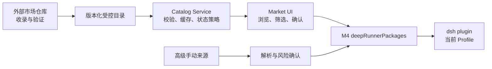

# M5 插件市场产品方案

状态：M5.1、M5.2 主链路及 M5.3 NPM 侧载 V1 已实现

实现进度：M5.1 的目录、schema、信任标签、搜索/筛选/详情、固定远程源、缓存和同源 API 已完成；M5.2 已实现 Preview/Execute 一次性操作令牌、移除确认、精确版本 mutation、integrity 预检、安装后 manifest/patch/lockfile 校验、安装 Receipt、运行时/原生 ABI 兼容审计、启动隔离、可逆禁用/启用、进度、取消、移除和重启入口。M5.3 V1 已在 Discover 增加隔离的 NPM/GitHub 侧载入口、只读解析、风险详情、一次性安装 token 和 Receipt 持久化。目录签名、私有/本地来源、直接 GitHub 制品安装，以及具有原生依赖重建、配置快照和自动回滚的完整 Repair/Loader 健康事务继续按后续切片推进。

## 1. 产品定义

M5 要交付一个“受控插件目录 + 分级信任提示 + 统一生命周期管理”的插件市场。

受控目录采用 App Store 式人工严选：任何条目都必须由仓库外的人工流程明确决定收录，不能由 npm/GitHub 搜索、Star 或下载量自动进入市场。信任等级用于表达已经验证到什么程度；`community` 仍是人工严选条目，不等于未筛选的互联网结果。

市场不是任意 npm/GitHub 搜索器，也不承诺所有展示插件都经过完整代码审计。DeepRunner 维护一个来源受控的市场目录，目录可以收录不同信任等级的插件；产品通过持续可见的标签和详情，让用户理解来源差异并自主决定是否安装，移除操作另有明确确认。

DeepRunner 本仓库负责：

- 获取、校验、缓存和展示受控市场目录。
- 呈现插件来源、信任等级、兼容性、许可和能力提示。
- 通过 M4 `deepRunnerPackages` 完成安装、更新和移除。
- 在操作后完成 manifest/Loader validation、Profile reconcile 和应用重启。
- 为手动 package、文件或链接提供明确隔离的高级安装入口。
- 处理离线、目录损坏、版本撤回和插件启动失败。

插件征集、发布者验证、元数据审核、版本审查和下架决策由外部仓库或流程完成。本仓库只消费最终目录中的信任字段，不实现审核后台。

以下能力不属于 M5：

- 任意 npm registry 或 GitHub 的全局搜索。
- 用户添加多个市场目录、组织私有市场和目录鉴权。
- 自动恶意代码审计平台。
- 评分、评论、支付和开发者账号体系。
- 插件静默安装或静默更新。

## 2. 产品原则

1. **开放但不混淆**：允许受控目录收录不同来源的插件，但必须清晰显示信任差异。
2. **验证不等于安全**：发布者身份、元数据和完整性验证不能被描述为代码绝对安全。
3. **版本必须确定**：安装和更新使用目录解析出的精确版本，不直接执行 `latest`。
4. **修改必须由用户发起**：安装、更新、禁用、启用和移除均需要用户主动点击；Preview token 仍绑定目标 Profile 和制品身份，但只有移除显示第二层 Review change 确认。
5. **所有变更共用 M4**：市场不实现第二套 npm/pnpm 安装器，也不暴露任意命令执行 API。
6. **来源持续可见**：信任标签出现在卡片、详情、已安装和更新页面，不依赖一次性确认弹窗传达。
7. **失败可以恢复**：市场或插件故障不得阻止 DeepRunner 核心启动和插件移除。

## 3. 市场范围

### 3.1 受控市场目录

M5 只搜索 DeepRunner 当前认可的市场目录。目录可以包含：

- DeepRunner 内置组件。
- 已验证发布者提供的插件。
- 通过元数据审核的社区插件。

目录由 DeepRunner 固定配置，用户不能在普通市场中把任意 URL 注册为新目录。前期可以随应用维护静态目录；后续由独立仓库发布版本化、可签名的远程目录。

### 3.2 手动来源

V1 用户可以通过 Discover 的高级入口提供：

- NPM package 名称或精确版本 spec。
- NPM 官网 package 页面。
- 公开 GitHub 仓库根链接；仅用于发现已经发布到 NPM 且 repository 元数据匹配的 package。

本地目录、任意 tarball、私有仓库、SSH/Git spec、自定义 registry 和直接执行 GitHub 仓库代码不属于 V1。

手动来源不进入市场搜索结果，不获得目录信任标签，也不能伪装成“已验证发布者”或“社区收录”。它依然必须经过 Host 校验、用户确认和 M4 包管理服务。

### 3.3 多目录来源

用户自定义市场目录、组织私有目录和带鉴权的源不属于 M5。数据模型应保留 `sourceId`，避免将来引入多个来源时重写安装记录；真正的来源管理 UI 放在 M8。

## 4. 信任模型

### 4.1 信任层级

| 层级 | 表达的事实 | 不代表什么 | 默认行为 |
| --- | --- | --- | --- |
| DeepRunner 内置 | 随应用交付，属于系统功能 | 不代表永远没有漏洞 | 显示系统组件；必要组件不可普通移除 |
| 已验证发布者 | 发布者身份、源码位置、许可或发布链路经过验证 | 不代表每一行代码均被审计 | 允许安装，显示“发布者已验证” |
| 社区收录 | 元数据和基本收录条件通过 | 不代表代码或发布者身份已验证 | 显示“社区收录”和增强风险提示 |
| 手动来源 | 由用户直接指定 NPM package/NPM 页面/公开 GitHub 仓库 | 不代表 DeepRunner 认可该来源 | 进入高级安装流程，显示 `Sideloaded · Unverified` |

信任层级由外部目录产生，DeepRunner 不根据下载量、Star 或客户端推断结果。

### 4.2 独立状态

以下状态不应压缩到信任层级中：

- `integrityVerified`：下载产物是否与目录声明一致。
- `compatible`：是否符合当前平台、架构、DSH 和 DeepRunner 版本。
- `status`：是否为 `listed`、`paused`、`deprecated` 或 `revoked`。
- `capabilities`：是否涉及网络、文件、命令执行或原生依赖。

例如，“发布者已验证”插件仍可能与当前平台不兼容；“社区收录”插件也可以具有有效 integrity。UI 必须分别表达这些事实。

### 4.3 UI 文案

允许使用：

- DeepRunner 内置
- 发布者已验证
- 社区收录
- 手动来源 / 未经验证
- 完整性已验证
- 与当前环境兼容

避免使用：

- 安全认证
- 绝对安全
- 无风险
- DeepRunner 保证

## 5. 信息架构

MVP 包含：

| 页面 | 用户任务 | 主要内容 |
| --- | --- | --- |
| 浏览 | 发现目录中的插件 | 推荐、新增、不同信任等级的插件卡片 |
| 分类 | 按用途查找 | 分类、标签、兼容性和信任等级筛选 |
| 已安装 | 管理当前 Profile | 当前版本、来源、状态和移除入口 |
| 更新 | 查看可用版本 | 当前版本、目标版本、来源和更新说明 |
| 高级安装 | 安装目录外插件 | NPM 包名、NPM 页面或公开 GitHub 仓库、风险说明和确认 |

搜索仅查询当前有效市场目录，不直接请求 npm/GitHub 全局搜索。

### 5.1 插件卡片

至少展示：

- 名称、图标和一句话说明。
- 发布者显示名。
- 信任标签。
- 分类和主要用途。
- 已安装、可更新、不兼容、暂停或撤回状态。

下载量和 Star 只能作为辅助信息，不能替代信任标签或决定验证结论。

### 5.2 详情页

至少展示：

- 完整说明、截图、分类和标签。
- package 名称、版本和更新时间。
- 发布者、来源仓库、主页和许可证。
- 信任层级以及该层级具体确认了什么。
- 支持的平台、架构和 DSH/DeepRunner 版本范围。
- 网络、文件、命令执行、原生依赖等能力提示。
- 当前 Profile、已安装版本和目标版本。
- 安装、更新或移除操作及进度。

## 6. 核心用户流程

### 6.1 浏览与搜索

1. Host 加载内置目录或最后一次校验成功的缓存。
2. Host 异步检查固定远程目录是否更新。
3. 用户浏览、搜索、分类或按信任等级筛选。
4. 不兼容或暂停条目可以展示，但安装按钮禁用并说明原因。

Client 只呈现 Host 返回的市场领域模型，不直接获取目录。

当前目录源固定为 `https://zhigui.github.io/DeepRunnerPlugins/catalog/v1/catalog.json`。首次市场请求会等待本 generation 的远程/缓存/内置目录决策，mutation 同样必须等待该决策，避免在撤回信息尚未加载时执行安装。远端目录只允许提供第三方条目，不能声明 `builtin` 或覆盖 launcher-owned id/package。

### 6.2 目录插件安装

1. 用户从详情页点击安装。
2. Host 按插件 id 从当前有效目录重新解析条目。
3. Host 校验目录状态、精确版本、integrity、平台、ABI、许可和当前 Profile。
4. Host 返回绑定 Profile、catalog version 和制品身份的短期一次性 Preview token。
5. 详情页持续展示信任层级、package、版本、来源、能力提示和原生构建依赖；不再显示第二层 Review change。
6. Client 直接提交 Preview token；Execute 重新校验绑定内容，再调用 `deepRunnerPackages.runPlugin(['add', exactSpec], ...)`。
7. UI 显示阶段、有界日志摘要、取消状态和失败结果。
8. 安装完成后校验 manifest、bundle patch、runtime ranges、lockfile 版本/integrity，保存包含 Node ABI/架构的 Receipt，并按需要重启 generation。

Client 回传的 package、version、source 和 Profile 均不能直接成为执行参数。

### 6.3 手动安装

1. 用户在 Discover 点击 `Install from source…`。
2. 用户提供 NPM package/NPM 页面或公开 GitHub 仓库根链接。
3. Host 只读解析固定公开来源，规范化 package，固定精确版本和 integrity；GitHub 仅用于读取根 `package.json` 并与 NPM repository 元数据互证。
4. Host 校验 DSH plugin manifest、当前 Profile 和运行时兼容性；V1 拒绝生命周期安装脚本及已知原生构建依赖。
5. UI 在详情卡持续显示 `Sideloaded · Unverified`、精确目标、来源、许可、faces、capabilities 和目标 Profile。
6. Host 签发五分钟有效、不可重放的一次性 token；安装接口只接受 token，用户点击 `Install unverified plugin` 后直接通过 M4 执行，不叠加 Review change。
7. 安装后使用与目录插件相同的 manifest/patch/lockfile validation，并把侧载元数据写入 Receipt。
8. 用户确认安装后关闭来源弹窗，将解析条目临时投影到标准 plugin detail；详情显示安装 loading、折叠日志、取消、失败和重启状态。成功后 Receipt 条目接管，失败时保留详情并允许重新检查来源。
9. 重启后侧载条目仅投影到 Installed，固定显示 `Sideloaded` / `Installed outside DeepRunner Market`，可 Disable、Enable、Remove。
10. NPM Receipt 可由用户主动 `Check for updates`；仅当 registry 精确版本高于 installed version 时签发更新 token。GitHub 来源默认不提供更新检查。
11. 同 package 后来被受控市场收录时，现有安装仍保持 Sideloaded，并提供显式 `Switch to Market version`；成功校验和安装后才把 Receipt 切换到 Market 来源。

### 6.4 更新

- 目录插件只从原始 `sourceId` 获取更新。
- 更新前显示当前版本、目标版本、来源、信任层级和 changelog。
- 目标必须解析为精确版本并校验 integrity。
- 首版一次只更新一个插件，不默认开放全部自动更新。
- NPM 侧载可由用户主动检查 registry 更新，不后台轮询、不静默更新；GitHub/其它手动来源没有可信更新元数据时不显示更新入口。
- 同 package 被目录收录后使用 `Switch to Market version` 显式迁移安装来源，不能只改变信任标签。

### 6.5 移除

- 市场目录不可用时仍允许移除已安装插件。
- 移除前检查必需 Bundle 和插件依赖。
- 移除通过同一个公共包 service 执行。
- `dsh plugin remove` 在当前 Profile 中转发 `pnpm remove`：删除直接依赖声明、lockfile importer、`node_modules/<package>` 安装入口，并由 DSH reconcile 删除 bundle layer。
- 移除成功后删除 Market Receipt 和禁用标记，并按需要重启。
- pnpm 全局 store 与其它依赖仍在使用的共享传递包不强制清空。

### 6.6 禁用、启用与客户端升级

- 禁用只改变 Profile 下的 DeepRunner 私有状态，不卸载 package、不修改 dependency/lockfile；重启后跳过插件 patches。
- 启用前重新执行兼容审计，审计通过并重启后恢复 composition。
- 客户端升级时比较 Node、DSH、Cordis 和 DeepRunner 版本；有原生构建依赖时额外比较 Receipt 的 Node module ABI 和架构。
- 不兼容或原生 ABI 来源未知的安装进入 `quarantined`，保留 package 但不加载；当前引导用户 Remove 后重新 Install。
- 完整 Repair UI 延后到能够明确重建原生依赖、验证结果并在失败时回滚之后，不能把同版本 `pnpm add` 包装为 Repair。

App 升级后的旧插件展示、启动隔离、状态矩阵和当前版本判断缺口，以[插件市场技术方案](plugin-market.md#app-升级后的旧插件状态)为准。

## 7. 目录数据契约

```ts
type TrustLevel = 'builtin' | 'verified-publisher' | 'community'

interface MarketCatalog {
  schemaVersion: number
  catalogVersion: string
  generatedAt: string
  sourceId: string
  sourceRevision: string
  entries: MarketEntry[]
  revocations?: Revocation[]
}

interface MarketEntry {
  id: string
  packageName: string
  displayName: string
  summary: string
  description: string
  publisher: string
  trustLevel: TrustLevel
  repository?: string
  homepage?: string
  license: string
  categories: string[]
  tags: string[]
  icon?: string
  screenshots?: string[]
  status: 'listed' | 'paused' | 'deprecated'
  release: MarketRelease
}

interface MarketRelease {
  version: string
  exactSpec: string
  distIntegrity: string
  sourceRevision: string
  publishedAt: string
  dshVersionRange: string
  deepRunnerVersionRange?: string
  platforms: Array<'darwin' | 'win32' | 'linux'>
  architectures?: string[]
  faces: Array<'host' | 'client'>
  capabilities: string[]
  buildScriptPackages?: string[]
  releaseNotes?: string
}

interface Revocation {
  pluginId: string
  version?: string
  reason: string
  action: 'block-install' | 'recommend-remove'
  publishedAt: string
}
```

约束：

- `trustLevel` 是目录发布结论，不由客户端自行升级。
- `version` 和 `exactSpec` 必须精确，不允许 `latest`、`next` 或宽松 semver range。
- `distIntegrity`、release source revision 和版本共同标识发布物。
- `buildScriptPackages` 必须逐 package 列出获准运行 lifecycle/build scripts 的依赖；不允许通配符或隐式 `--all`。
- `sourceId` 必须进入安装记录，为后续更新和多来源支持保留身份。
- `paused` 阻止新安装和更新；`deprecated` 提供迁移或移除提示。
- 撤回规则优先于普通条目和缓存。

手动安装记录至少保存：

```ts
interface InstalledPluginOrigin {
  pluginId?: string
  origin: 'catalog' | 'sideload-npm' | 'sideload-github'
  sourceId?: string
  catalogVersion?: string
  exactSpec: string
  resolvedVersion: string
  distIntegrity: string
  normalizedSource?: string
}
```

## 8. 目录获取与安全边界



- 第一版可以使用随应用发布的静态目录；远程阶段仅连接固定 HTTPS origin。
- 远程目录需要 schema、catalog version、响应大小、超时、签名/来源和缓存校验。
- 未校验的新响应不得覆盖最后一次有效目录。
- Client 不直接访问网络、文件系统或 child process。
- mutation route 使用领域命令，不提供 `runCommand(string)`。
- 每个 mutation 绑定当前 generation 和 `deepRunnerProfiles.current`。
- 手动来源也不能绕过 scheme、路径、包规范和参数校验。

## 9. 状态与异常体验

| 状态 | 产品行为 |
| --- | --- |
| 离线 | 使用内置目录或最后一次有效缓存，显示目录版本 |
| 目录更新失败 | 保留旧目录，不影响已安装插件管理 |
| schema/签名/integrity 失败 | 拒绝新目录并记录诊断 |
| 不兼容 | 允许查看详情，禁用安装并显示原因 |
| paused | 禁止安装和更新，已安装用户仍可移除 |
| revoked | 阻止对应版本安装，并提醒已安装用户移除 |
| mutation busy | 显示当前操作，不启动第二个 mutation |
| 安装失败或取消 | 显示有界日志摘要并提供重试、修复或移除 |
| 插件启动失败 | 进入 M3 恢复流程，允许禁用或移除 |

## 10. M5 交付切片

### M5.1 受控目录与浏览

- 定义市场 schema、信任层级和 fixture catalog。
- Catalog service 加载、校验和缓存固定目录。
- 完成浏览、分类、搜索、筛选和详情。
- 实现兼容、暂停、撤回、离线和目录损坏状态。

### M5.2 单插件生命周期

- 安装进度、取消和失败恢复，以及移除确认。
- 已安装状态、单插件更新和移除。
- post-install validation、reconcile 和重启。
- 所有 mutation 接入 M4 公共包 service。

### M5.3 高级手动安装

- 已在 Discover 提供 NPM package/NPM 页面/公开 GitHub 仓库结构化入口。
- Host 只读解析固定来源，签发绑定 Profile 和精确 artifact 的一次性 token。
- Receipt 保存规范化侧载元数据，重启后仅在 Installed 中展示并持续标记未经验证。
- NPM Receipt 支持主动更新检查；匹配目录条目支持显式切换为 Market version。
- 本地/私有来源、任意 artifact 及需要安装脚本或原生构建的 package 延后。

### M5.4 远程目录

- 接入外部仓库发布的版本化目录。
- 实现来源/签名校验、缓存和内置回退。
- 支持目录级暂停和版本撤回信息。

多个用户自定义目录、组织私有源和鉴权仍留到 M8。

## 11. 验收标准

- 市场能展示内置、已验证发布者和社区收录条目，并始终显示正确标签。
- 搜索仅限受控目录，不把任意 npm/GitHub 结果当作市场条目。
- 每个目录安装目标都有精确版本、source、integrity、许可和兼容信息。
- 安装、更新和移除全部通过 `deepRunnerPackages`，并绑定当前 Profile/generation。
- Client 篡改 package、version、trustLevel、source 或 Profile 不能改变 Host 实际执行目标。
- 手动来源不能获得目录信任标签，也不能提交任意 shell 命令。
- 不兼容、暂停、撤回、目录损坏、busy、cancel 和 non-zero exit 均有自动测试。
- 安装后 validation 失败不会被报告为成功，并能进入恢复或移除流程。
- 市场 bundle 或远程目录不可用时，不影响 DeepRunner 核心启动和已安装插件移除。

## 12. 待产品确认

- 市场首页是否默认混合展示已验证发布者和社区插件，或按区域分组。
- 后续是否支持私有 registry/仓库，以及相应的凭据与组织策略。
- 发布者验证的最终中文/英文文案。
- 撤回插件对已安装用户是仅提醒，还是提供一键移除但仍由用户确认。
