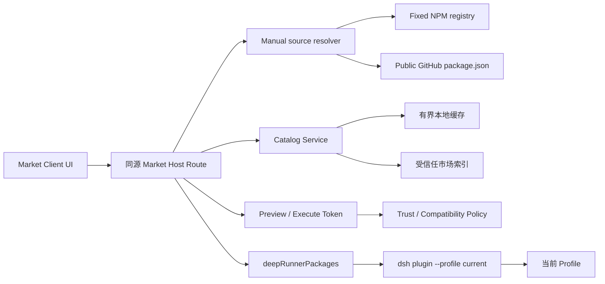

# 插件市场

状态：M5.1、M5.2 主链路及 M5.3 NPM 侧载 V1 已实现

当前实现覆盖内置/远程受控目录、严格 schema、分级信任读模型、同源 Host API、市场浏览 UI，以及通过 M4 执行的精确版本安装、更新、禁用、启用和移除。mutation 使用“Preview → 短期一次性令牌 Execute”，执行前重新校验当前 Profile、catalog version、package、版本、source revision 和 integrity；安装、更新、禁用和启用由用户点击后直接消费 token，只有移除会额外显示 Review change 确认。安装前查询 registry `dist.integrity`；安装后继续校验实际 manifest、`dsh.bundle.patch`、Profile lockfile 版本和 integrity，并写入安装 Receipt。

独立 `DeepRunnerPlugins` 数据仓库提供市场条目。Host 已接入固定 GitHub Pages 目录，具备超时、大小限制、拒绝重定向、ETag、原子 last-known-good 缓存、离线内置回退和远端系统组件防覆盖。Discover 现已提供结构化 `Install from source…` 入口；V1 接受 NPM package、NPM package 页面和公开 GitHub 仓库，并把 GitHub 仅作为发现已发布 NPM package 的入口。远程目录签名、私有来源、直接仓库制品安装和完整的独立 Loader 健康事务/自动回滚仍属于后续增强。

产品范围、信息架构、交付切片和验收标准见 [M5 插件市场产品方案](m5-plugin-market-product.md)。插件收录、发布者验证、元数据审核和下架决策在外部市场仓库进行，不属于本仓库实现范围。

## 目标

插件市场负责消费受控目录、呈现分级信任并协调插件操作，不成为新的包管理器。安装、更新和移除最终必须委托给 `deepRunnerPackages.runPlugin()`，Profile 身份必须来自 `deepRunnerProfiles.current`。

## 架构



Market Client 不直接访问网络、文件系统或 child process。Host route 只暴露领域操作，例如查询、查看详情、安装、更新、移除和取消。

当前固定目录源为 `https://zhigui.github.io/DeepRunnerPlugins/catalog/v1/catalog.json`。缓存位于当前 Profile 的 `.deeprunner/market/catalog-v1.json`，只保存严格校验成功的目录和 ETag；损坏缓存会被忽略，网络失败时使用最后有效缓存或随应用交付的内置目录。

## 市场索引

第一版使用静态、可缓存、可签名的 JSON 市场目录，目录可以包含内置、已验证发布者和社区收录插件。普通市场只搜索该受控目录，不把任意 npm/GitHub 搜索结果直接当作信任来源。

索引条目建议包含：

```ts
interface MarketEntry {
  id: string
  packageName: string
  displayName: string
  description: string
  publisher: string
  homepage?: string
  repository?: string
  license: string
  trustLevel: 'builtin' | 'verified-publisher' | 'community'
  version: string
  exactSpec: string
  distIntegrity: string
  dshVersionRange: string
  deepRunnerVersionRange?: string
  platforms: Array<'darwin' | 'win32' | 'linux'>
  faces: Array<'host' | 'client'>
  permissions: string[]
  sourceId: string
  sourceRevision: string
  status: 'listed' | 'paused' | 'deprecated'
  updatedAt: string
}
```

索引本身需要：

- 固定 schema version 和 catalog version。
- 第一版使用内置目录；远程阶段只允许 HTTPS 固定 origin。
- 响应大小和超时上限。
- 远程目录使用签名或可验证的发布来源。
- ETag/Last-Modified 缓存。
- 过期缓存提示，而不是无提示地把旧数据当成最新结果。

## 信任层级

| 级别 | 含义 | 默认行为 |
| --- | --- | --- |
| DeepRunner 内置 | 随应用交付的系统组件 | 标记为系统组件；必需组件不允许普通移除 |
| 已验证发布者 | 身份、源码、许可或发布链路经过验证 | 显示验证标识，仍需用户主动发起安装 |
| 社区收录 | 元数据审核通过，代码未逐版本完整审计 | 显示社区来源和增强风险提示 |
| 手动来源 | 用户输入 NPM package/NPM 页面/公开 GitHub 仓库 | 进入隔离的侧载流程，显示 `Sideloaded · Unverified` |

信任等级、artifact integrity、兼容状态和暂停/撤回状态是不同事实，UI 必须分别表达。“已验证发布者”不能表达“代码安全”。手动来源不进入市场搜索结果，也不能获得目录信任标识。

Host 必须从当前有效目录重新解析目录插件的目标，不能信任 Client 提交的来源、版本、信任等级或 Profile。手动来源必须经过独立 schema、协议和包规范校验，不允许退化为 `runCommand(string)`。

## 安装流程

1. 用户打开详情页并选择安装或更新。
2. Host 根据插件 id 从当前有效目录重新解析条目，检查 listed/revoked、平台、架构、DSH 和 DeepRunner 版本。
3. Host 生成五分钟有效、不可重放的 Preview token；token 绑定当前 Profile、catalog version、package、版本、source revision 和 integrity。
4. UI 在详情页持续显示 package 名称、版本、来源、能力和原生构建依赖；用户点击安装或更新后，Client 直接提交 Preview token，不再显示第二层 Review change。
5. Execute 消费 token，并在执行前重新校验绑定内容；目录或 Profile 已变化时拒绝本次操作，由用户重新发起。
6. Host 查询 registry `dist.integrity`，匹配后才调用 `runPlugin(['add', exactSpec], invokingDir, signal)`。
7. 流式 stdout/stderr 映射为有界操作日志，M4 负责 busy、deadline、取消和进程树回收。
8. pnpm 成功后校验实际 package name/version、Node/DSH/Cordis range、`dsh.bundle.patch` 的物理边界，以及 `pnpm-lock.yaml` 中的精确版本和 integrity。
9. 校验通过后原子写入安装 Receipt；原生依赖 Receipt 记录 Electron Node ABI 和架构。
10. 用户重启 DeepRunner，新 generation 在组合第三方补丁前再次执行兼容审计。

版本必须固定为精确 spec，不使用 `latest` 作为最终安装参数。

### Discover 侧载流程

Discover 筛选栏右侧提供次要入口 `Install from source…`。它与普通市场搜索完全分离，支持：

- NPM package 名称，例如 `dsh-some-plugin` 或 `@scope/dsh-plugin`。
- 带精确版本的 package spec，例如 `@scope/dsh-plugin@1.2.0`；不接受 range 或移动 tag。
- `https://www.npmjs.com/package/...` package 页面。
- `https://github.com/<owner>/<repo>` 公开仓库根链接；Host 只读取根 `package.json` 发现 package 名称，并要求 NPM 发布元数据反向指向同一仓库。

Host 只访问固定的 `registry.npmjs.org` 和 `api.github.com`，拒绝重定向、凭据、SSH、私有仓库、任意 tarball、任意 registry 以及超限响应。解析阶段不会执行仓库代码；它检查 package identity、精确版本、`dist.integrity`、`dsh.bundle.patch`、Node/DSH/DeepRunner 兼容范围和已知安装脚本/原生依赖。V1 对包含 `preinstall`、`install`、`postinstall` 或已知原生构建依赖的侧载包 fail closed，后续只有在具备独立审核与重建事务后才开放。

解析成功后，Client 展示名称、版本、发布者、许可、来源、faces、capabilities、当前 Profile 及持续可见的 `Sideloaded · Unverified` 风险标签。Host 返回五分钟有效且不可重放的一次性 token；安装接口只接受该 token，不接受 Client 重新提交 package、版本、URL 或 Profile。用户在这张详情卡上点击 `Install unverified plugin` 即安装，不再叠加通用 Review change 弹窗；Remove 仍保留确认。

侧载弹窗只负责输入来源、展示解析结果和第一次安装确认。用户点击安装、Host 接受 token 并返回 operation 后，弹窗立即关闭，但 Client 会把已解析条目投影为临时的 Sideloaded catalog view、选中它并打开标准 plugin detail。安装按钮在详情中显示环形 loading 和 `Installing…`；同一页下方复用普通市场插件的可折叠 operation stdout/stderr、取消、失败原因和重启提示。安装成功并重新加载 catalog 后，Host Receipt 投影出的 Installed 条目替换临时条目；安装失败时临时详情和日志保留，并提供 `Inspect source again` 重新解析来源，而不会调用只接受 Market id 的普通安装 API。

安装成功后的 Receipt 会保存侧载条目的规范化元数据。市场重启后从 Receipt 将其重新投影到 `Installed`，而不把它加入 Discover 搜索或赋予目录信任等级。详情固定显示信任标签 `Sideloaded` 和状态说明 `Installed outside DeepRunner Market`，并提供 Disable、Enable 和 Remove。

安装来源和目录信任是两个独立事实。即使同一个 package 后来进入受控市场，现有安装也不会自动变成 Official/Community；Installed 仍按 Receipt 显示为 Sideloaded，并出现 `Switch to Market version`。用户点击后，Host 从当前目录重新解析精确 Market artifact、校验 integrity 并执行 add；post-install validation 成功后才以 Market source/entry 覆盖旧 Receipt。目标版本与当前版本相同时也必须走这条显式迁移，不靠 UI 重贴标签。

NPM 侧载提供用户主动触发的 `Check for updates`。Host 从 Receipt 取得 package 和 NPM 来源，只查询 registry 的最新发布元数据；仅当解析出的 semver 高于 installed version 时，详情卡才允许 `Update sideloaded plugin`，执行仍使用绑定 package/version/integrity/Profile 的短期一次性 token。它不是后台轮询或静默更新。GitHub 来源默认不提供更新检查；当前 V1 的 GitHub 输入仍只用于 GitHub→NPM 发现和互证，未来若增加 GitHub artifact 直装，同样默认无自动更新，除非另行定义不可变 revision 和可信更新策略。

## 更新与移除

- 更新前显示当前版本、目标版本和 changelog/source 链接。
- 批量更新首版不默认开放；一次只变更一个插件，便于归因。
- 移除前检查是否为 Profile 必需 Bundle 或其它功能依赖。
- 移除通过 `runPlugin(['remove', packageName], currentProfileDir)` 调用 `dsh plugin --profile <current> remove`，DSH 在 Profile 目录中转发为 `pnpm remove`。
- pnpm 成功时会从 Profile `package.json`、lockfile 和 `node_modules/<package>` 安装树中移除该直接依赖；DSH reconcile 随后从 `dsh.profile.bundles` 删除对应层。
- Market 随后删除该插件的 Receipt 和禁用状态，并要求重启 generation。
- 移除不会强制清空 pnpm 全局内容寻址 store，也不会删除仍被其它已安装依赖共享的传递包；这是包管理器缓存/去重行为，不表示插件仍处于 Profile 已安装状态。
- 当前精确写入过的 `pnpm-workspace.yaml#allowBuilds` 审核项不会随卸载自动缩减；它只是一条构建许可，不会自行安装或加载 package。后续可基于剩余 Receipt 做安全的引用计数清理。
- 插件自己不能通过市场 API 静默更新自身。

## 禁用、启用与兼容隔离

- 禁用不会调用 pnpm，不修改 Profile dependency、lockfile 或 `node_modules`；它只把 package name 写入当前 Profile 的 DeepRunner 私有状态，重启后启动组合器跳过该插件的 Host/Client patches。
- 启用删除该禁用标记，只有兼容审计通过的插件才允许重新启用；重启后重新加入 composition。
- 客户端升级后，每个第三方 bundle 会检查 manifest 的 Node engine、DSH/Cordis ranges，以及 Receipt 中的 Node module ABI 和架构。
- 原生插件的 ABI 与新客户端不一致时状态为 `quarantined`，package 仍保留在 Profile 中，但不会加载；当前版本提示用户先 Remove、再 Install，以生成面向当前运行时的新 Receipt。
- 当前不把“再次 add 同一版本”称为 Repair，因为 pnpm 不保证它会重建已经存在的原生依赖。未来只有在具备配置快照、明确 rebuild/reinstall、安装后验证和失败回滚后才提供 Repair UI。
- 历史原生插件没有 Receipt 时按 fail-closed 隔离，避免把未知 ABI 的 `.node` 模块加载进新 Electron；无原生依赖且 manifest 兼容的外部安装可继续加载，但显示 `unverified`。

## App 升级后的旧插件状态

App 升级不会自动更新插件。新 generation 启动前，桌面启动器会重新审计当前 Profile 中的每个第三方 bundle；审计失败的插件保留在 Profile 和 `node_modules` 中，但不会加入 Host/Client patch composition。因此，兼容性隔离发生在插件代码加载之前，而不只是市场 UI 上的警告。

当前状态映射如下：

| App 升级后的情况 | 市场界面 | 启动行为 | 可用操作 |
| --- | --- | --- | --- |
| 已安装版本仍兼容，目录版本相同 | 列表显示 `Installed · <installedVersion>` | 继续加载 | Disable、Remove |
| 已安装版本仍兼容，目录提供不同版本 | 列表和详情显示 `Update`，并进入 `Updates` 标签页 | 继续加载当前已安装版本，不自动更新 | Update、Disable、Remove |
| 已安装 manifest 的 Node engine 或 DSH/Cordis dependency range 不满足新运行时 | 显示 `Compatibility blocked`，详情显示具体依赖原因 | 跳过该插件，不加载 | 兼容的新目录版本可更新；否则 Remove |
| 原生插件 Receipt 中的 Node module ABI 或架构与新 App 不一致 | 显示 `Compatibility blocked`，提示 Remove 后重新 Install | 跳过该插件，不加载 | Remove；移除后重新安装以生成新 Receipt |
| 当前目录 release 不支持新版 App、平台或架构 | 显示 `Incompatible` | 已安装插件是否加载仍由其自身 manifest/Receipt 审计决定 | Host 会拒绝安装或更新到该目录 release；已安装项仍可 Remove |
| 插件已由用户禁用 | 显示 `Disabled` | 跳过该插件，不加载 | Enable、Remove；Enable 前重新执行兼容审计 |

`compatible` 和 `activationStatus` 表达不同事实：前者判断“当前目录 release 能否安装到当前 App”，后者判断“Profile 中已经安装的实体能否在当前 generation 激活”。所以可能出现“目录最新版不兼容，但旧安装仍通过审计”的组合；UI 和 Host policy 不应把两者合并成一个布尔状态。

当前实现还有以下已知展示和版本判断缺口：

- `Updates` 标签暂时没有数量徽标或 App 升级后的主动提醒，用户需要进入插件市场查看。
- 详情元数据中的 `Version` 当前表示目录目标版本，尚未并列显示 `Installed <version> → Available <version>`。
- `hasUpdate` 当前按“已安装版本字符串与目录版本不相等”判断，而不是使用 `semver.gt()`；目录版本回退时也可能被归入 `Updates`。
- Receipt 保存安装时的运行时身份，但没有保存该历史 release 的 `deepRunnerVersionRange`。对已安装非原生插件的重新审计主要依赖 package manifest 中的 Node/DSH/Cordis ranges；仅存在于旧目录元数据中的 DeepRunner range 不能完整参与升级后判断。
- 当前没有 `Update required`、`Reinstall required` 和 `No compatible version` 三种更明确的复合状态；现有 UI 通过 `Update`、`Compatibility blocked`、原因文本和 `Remove` 组合表达。

后续状态模型宜显式增加上述复合状态，并在插件入口及 `Updates` 标签显示数量。实现时必须保持启动器的 fail-closed 规则：任何 UI 提示或目录请求失败都不能让审计不通过的插件进入 composition。

## Profile 中的文件布局

```text
<DSH_HOME>/profiles/<profile>/
├── package.json                         # 直接依赖和 dsh.profile.bundles
├── pnpm-lock.yaml                       # 精确解析版本与 integrity
├── pnpm-workspace.yaml                  # allowBuilds 审核许可
├── node_modules/<plugin-package>/       # 当前 Profile 的插件入口/实体链接
└── .deeprunner/market/
    ├── catalog-v1.json                  # last-known-good 目录缓存
    ├── install-receipts-v1.json         # source/catalog/制品凭据和安装时运行时身份
    └── plugin-state-v1.json             # 可逆的手动禁用集合
```

pnpm 的全局 store 位于 pnpm 自己管理的位置，不属于 DeepRunner Profile，也不作为插件是否已安装或是否启用的判断依据。

## 失败恢复

- 记录最近一次操作的插件、Profile、argv 摘要、时间和结果，不记录 secret。
- 安装过程可取消，但 UI 要说明取消可能发生在包管理器已写入部分文件之后。
- 非零退出后运行只读一致性检查，并提供官方 `dsh plugin ... install` 修复路径。
- Renderer boot 报告失败插件时，恢复窗口直接链接到卸载/禁用流程。
- 市场缓存损坏不得影响 DSH 核心启动。

## Host API 设计原则

- 使用领域命令，不提供 `runCommand(string)`。
- 目录 mutation route 只接受 schema 校验后的 plugin id 和 operation；侧载 execute 只接受 Host 签发的一次性 token。
- 使用同源、method、content-type、body size 和 request concurrency 校验。
- 每个 mutation 都绑定当前 generation 和 Profile；Client 不提交 Profile 名称。
- 状态流有界，慢 consumer 不得导致无限内存增长。

## 首版退出条件

- 能从 fixture catalog 浏览不同信任等级，并安装、更新、移除测试插件。
- 所有 mutation 实际调用 `deepRunnerPackages.runPlugin()`。
- 错误、取消、busy 和重启流程均有自动测试。
- 篡改信任等级、不受信任索引、篡改条目和不匹配 integrity 被拒绝。
- 手动来源始终显示 `Sideloaded · Unverified`，经过结构化详情检查和公共包 service；只有移除再显示第二层确认。
- 市场 bundle 禁用后不影响普通 DeepRunner 启动。
