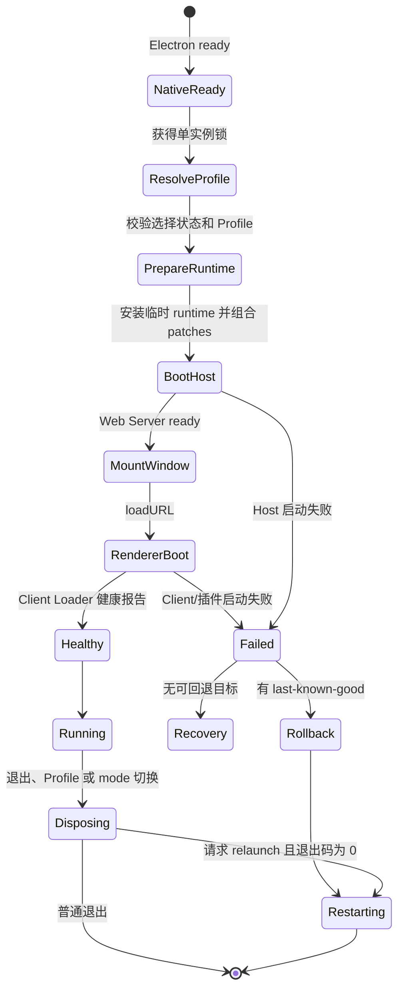

# 运行时与生命周期

状态：已规划

## Generation 定义

一个 generation 是一次完整且不可变的运行组合，包括：

- 当前 Profile 身份。
- 完整 Bundle/Patch 顺序。
- Host Cordis root。
- Host services 和第三方插件实例。
- Web Server 端口。
- BrowserWindow、Tray 和 Client plugin tree。
- 当前 UI mode。

Profile 或 mode 发生变化时，不修改当前 generation；应用 dispose 它并启动新进程。

## 启动状态机



## 启动顺序

1. 设置产品名并获取单实例锁。
2. 安装 SIGINT、SIGTERM 和 Electron `before-quit` 协调器。
3. 解析 DSH Home 和 Electron `userData`。
4. 读取 Profile selection state；校验 pending、active、last-known-good。
5. 准备 Profile、Bundle、用户 patch 和 DeepRunner 最终 overlay。
6. 创建打包 pnpm、DSH、Node helper 的 generation 私有环境。
7. 在 Loader entry 前 provide Launcher facts 和内部 runtime。
8. 启动 Host Cordis root 和 loopback Web Server。
9. Desktop Host plugin 注册主 BrowserWindow 和 renderer-health route。
10. 加载主 Web URL并创建托盘。
11. 主 Renderer 等完整 Client Loader settle 后报告 terminal outcome。
12. Launcher 校验 generation id；只有 `healthy` 才提交 Profile 为 last-known-good。

## Profile selection state

建议状态格式：

```json
{
  "version": 1,
  "active": "deeprunner",
  "pending": "team-profile",
  "lastKnownGood": "deeprunner"
}
```

要求：

- 文件位于 Electron 私有 `userData`，不放入用户可编辑 Profile。
- 目录权限尽可能限制为当前用户。
- 原子写入，不跟随目标符号链接。
- 文件大小有上限，解析失败时恢复安全默认值。
- `pending` 只有下一次启动成功后才成为 active/last-known-good。

## Renderer 健康提交

窗口 `loadURL()` 成功不代表插件树健康。Renderer 必须通过同源的精确 Host route 报告：

- `healthy`：Client Loader 完成且必需插件已激活。
- `failed`：失败插件列表和有界错误摘要。

Host 校验 request origin、method、content type 和 body 上限。只有 `healthy` 才提交 last-known-good。

`BrowserWindow.loadURL()` 只证明导航完成，不是健康信号。当前实现会等待最多 20 秒的同 generation Loader 报告；failed 或 timeout 会让 generation 启动失败。若当前 Profile 与 last-known-good 不同，Launcher 会 dispose 失败现场并自动 relaunch，下一进程按既有状态机回滚；last-known-good 自身失败则直接挂载最小恢复 generation，避免无限重启。

## 重启流程

Profile 或 mode 切换顺序：

1. 校验目标。
2. 原子持久化 pending 或 settings。
3. 标记 native exit 为 relaunch。
4. 请求一次 shutdown。
5. dispose Cordis root。
6. 停止包管理、PTY 和更新下载等子进程。
7. 释放 BrowserWindow、Tray 和临时 runtime。
8. dispose 成功且退出码为 0 时调用 `app.relaunch()`。
9. `app.exit()` 结束旧进程。

同一目标的并发切换共享 operation；不同目标不能覆盖已提交的 pending 目标。

## 退出策略

- 第一次退出：进入有序 dispose，并启动 5 秒默认 deadline。
- deadline 到期：以失败码强制退出。
- dispose 期间第二次退出：立即升级为强制退出。
- relaunch 只发生在成功的零码退出。
- crash 或启动失败不自动形成无限重启循环。

### 已实现的启动/退出栅栏

`SIGINT`、`SIGTERM` 与 Electron `before-quit` 在窗口挂载前统一进入 generation coordinator；final native exit 前会先卸载这些 listener。Coordinator 同时持有 in-flight generation factory，因而退出发生在 Host 启动期间时，会在 deadline 内等待 factory settle，并 dispose 它产生的 generation。启动 continuation 不能把已经进入 `disposing` 的状态改回 `running`。

## 安全恢复模式

当默认和 last-known-good 都无法启动时，当前实现进入不依赖 DSH Host 的最小 Electron 恢复 generation：

- 本地页面无脚本、无 preload、无 Node integration，操作只通过固定导航命令进入 Main。
- 显示有界错误摘要、失败 Profile，以及兼容/不可用 Profile 列表。
- 可选择其他 Profile、重试、退出，或请求一次性安全模式。
- 安全模式使用 launcher-owned 隐藏 Profile 锚点，从解析阶段只加载官方 Web bundles、DeepRunner desktop layer 和最终 loopback overlay；不读取用户 Profile manifest、Profile patch、home patch 或第三方 bundle。
- 一次性 marker 位于 Electron 私有 `userData`，严格校验并在启动前消费，不能形成永久模式。

DeepRunner Terminal 和插件移除已经通过 M4 的受控包管理 service 获得统一 runtime；选择其他 Profile 和安全模式继续保证第三方故障不会永久阻止应用启动。恢复窗口中的直接修复 UI 随后复用该 service。
