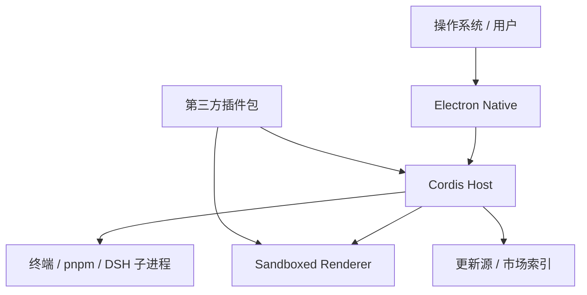

# 安全模型

状态：M7 更新供应链已实现，其余模型持续维护

## 需要保护的资产

- 模型 API key 和其它 credentials。
- 用户源码、Workspace 和文件权限。
- Session 历史和 settings。
- Profile manifest、lockfile 和插件代码。
- 应用签名、更新清单和安装器。
- 本地终端、PTY 和子进程能力。
- Electron `userData` 中的选择与恢复状态。

## 信任边界

- Electron Native 和 DeepRunner 自有 Host 代码属于应用信任域。
- 官方 DSH 包固定版本并作为受信任供应链依赖。
- 第三方插件是本地执行代码，安装前必须明确告知用户。
- 内置、已验证发布者、社区收录和手动来源是产品信任标签，不自动赋予插件代码执行信任。
- 手动 NPM 包名、NPM 页面或公开 GitHub 仓库来源只能通过结构化入口和公共包 service 执行，不提供通用 shell route；本地路径、私有源和直接 GitHub 制品不受支持。
- Renderer 即使同源也按不受信任浏览器内容对待。
- 市场索引只提供元数据，不自动赋予插件代码信任。

## Renderer 控制

- `nodeIntegration: false`。
- `contextIsolation: true`。
- `sandbox: true`。
- `webSecurity: true`。
- 不提供通用 preload 或 IPC invoke bridge。
- 主框架只能在 generation 的精确 loopback origin 内导航。
- 新窗口全部 deny；允许的 HTTP/HTTPS/mailto 交给系统浏览器。
- 禁止 `file:`、`javascript:`、`data:` 等外部导航协议。

## Web Server 控制

- 强制 `127.0.0.1`，禁止 `0.0.0.0` 和局域网暴露。
- 使用随机端口，端口不是认证机制。
- Desktop 专用 route 校验 `Origin`、method、content type 和 body size。
- mutation route 采用领域 schema 和 concurrency gate。
- Market mutation 使用短期、一次性 Preview token，绑定当前 Profile、catalog version 和精确制品身份；Execute 前重新校验，token 不可重放。
- Renderer health route 校验精确 Origin、method、content type 和严格 body 上限。
- 不通过 query string 传递 secret、重连 token 或命令。
- 错误响应不泄漏绝对 credential path、环境变量或完整 stack。

## Profile 和文件系统

- DeepRunner 将 `DSH_HOME` 固定到 Electron `userData/dsh-home`，不接受环境中的共享 `DSH_HOME` 或默认 `~/.dsh`。
- Profile 名称使用严格格式白名单。
- Launcher 只接受解析后的绝对目录。
- 私有状态目录和原子写入拒绝符号链接目标。
- 状态文件有大小上限和 schema version。
- 插件市场不自行编辑 Profile manifest；委托官方 CLI。
- 任何 destructive repair 都需要明确用户确认和可恢复方案。

## 子进程

- 使用 argv 数组和 `shell: false`。
- 校验 NUL、绝对 cwd 和受支持操作。
- 不继承不需要的环境变量。
- 不把 Electron RunAsNode 暴露给普通插件进程。
- 所有进程属于 generation，并支持完整进程树终止。
- stdout/stderr/PTY history 有界且进行 secret redaction。

## 插件供应链

- 固定 package 版本和 registry/source。
- 对 registry tarball 使用 integrity 验证。
- 显示 publisher、repository、license 和 native dependency。
- 安装前显示目标 Profile 和权限风险。
- 验证插件 package exports、DSH metadata 和平台约束。
- 安装后校验实际 manifest、bundle patch 物理边界和 Profile lockfile integrity，并保存包含运行时版本、Node ABI 与架构的 Receipt。
- 启动组合第三方 bundle 前重新校验 Node/DSH/Cordis ranges；原生 ABI 不一致或来源未知时保留 package 但跳过其 Host/Client patches。
- 禁用状态与安装状态分离；禁用不执行 pnpm、不删除 package，启用前必须重新通过兼容审计。
- 许可证文本和 third-party notice 是重新分发门禁。
- 未验证插件默认不获得 DeepRunner 内部 runtime service。

## 更新供应链

- electron-updater 只使用打包时写入的公开 GitHub provider，Renderer 不能覆盖 feed 或下载路径。
- electron-builder metadata 绑定版本、平台、架构、artifact size 和 SHA-512。
- macOS Squirrel 更新要求 Developer ID 签名应用；Windows updater 校验 Authenticode publisher。
- 下载由 updater 写入应用私有缓存，并支持差分下载。
- 更新失败或用户取消不会删除当前安装；下载完成后只在用户重启或正常退出时安装。
- 发布流水线在 draft 和回下载阶段复验 metadata 引用的实际 artifact。

## 日志与隐私

- 默认不记录 API key、authorization header、完整环境和 Session 内容。
- 市场/更新网络日志只保留必要状态码、版本和错误分类。
- 诊断包由用户显式生成，并在生成前列出内容。
- 尊重上游 telemetry opt-out；DeepRunner 不另建隐式遥测。

## 发布前威胁检查

- 跨域导航和 window.open 绕过。
- loopback CSRF 和 DNS rebinding 场景。
- 恶意 Profile 名称、路径和符号链接。
- package spec/shell 参数注入。
- 恶意市场索引和 artifact URL。
- ASAR 虚拟路径执行。
- Windows command shim quoting。
- 更新回滚和重复安装。
- Renderer 插件启动失败导致的恢复绕过。
